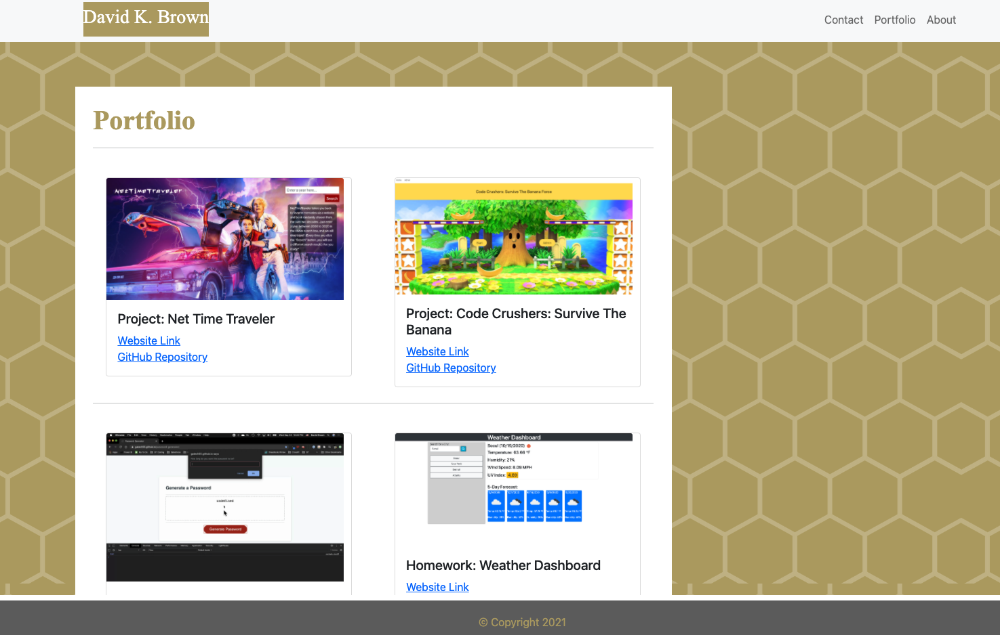

# react-portfolio

David K. Brown's React Portfolio

## Table of Contents

- [Description](#description)

- [Screenshots](#screenshots)

- [Acceptance-Criteria](#Acceptance-Criteria)

- [Installation](#installation)

- [Credits](#credits)

- [Contributing](#contributing)

- [Copyright](#copyright)

## Description

The purpose of this app was to update the portfolio that I created earlier in the class to use React. Previously the website used only HTML and CSS while now it uses React. Along with using React I also had to use Hashrouter for the different routes that were used. Overall this new portfolio uses some of the latest technologies.

## Screenshots





## Acceptance-Criteria

```md
## Requirements

- Updated portfolio featuring 6 total projects

- Use React

- A `Header` component that appears on multiple pages

- A single `Project` component that will be used multiple times on a single page

- Navigation with React Router, dynamic rendering, or another third part router

- A `Footer` component that appears on multiple pages

- Update GitHub profile with pinned repositories featuring those same projects

- Deploy this site to GitHub Pages using the [Create React App docs for deployment.](https://create-react-app.dev/docs/deployment/#github-pages)

- **Important**: Be sure to push your codebase to GitHub and **NOT** your built and deployed code. Ensure this happens by following the above instructions and using the `gh-pages` branch to host the deployed application's code.
```

## Installation

To access this application you will need to visit my GitHub page and the "react-portfolio" repository. After the repository is cloned/forked you can make edits to the application in your repository. Any questions should be directed to [David Brown](mailto:gatech55@gmail.com). The application repository can be found here: [ReactPortfolio](https://github.com/GaTech55/react-portfolio). The GitHub Page site can be found here: [ReactPortfolio](https://gatech55.github.io/react-portfolio/#/about).

## Credits

This project was bootstrapped with [Create React App](https://github.com/facebook/create-react-app).

© 2019 Trilogy Education Services, a 2U, Inc. brand. All Rights Reserved.
[GitLab-20-Homework](https://gt.bootcampcontent.com/GT-Coding-Boot-Camp/gt-inc-fsf-pt-08-2020-u-c/tree/master/20-State/02-Homework)

## Contributing

| **Commits** | **Contributor** |

| 07| [GaTech55](https://github.com/GaTech55)|

## Copyright

Copyright (c) 2021 David Brown.
